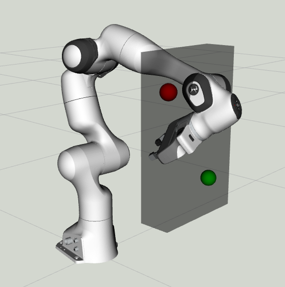

OMPL Constrained Planning
=========================

This tutorial shows how to use OMPL's `Constrained planning capabilities`_ from MoveIt. It will be easier to follow if you have read through the tutorial on the `move group Python interface`_. The tutorial on the `Move Group Interface`_ shows you how to solve a motion planning problem with path constraints. In this tutorial we will do the same with with different settings for OMPL, using the Python interface.

TODO create video.

When should I use this planner?
^^^^^^^^^^^^^^^^^^^^^^^^^^^^^^^^^^^^^^^^^^^
The current implementation supports the following constraints:

* Position constraints modelled as a `shape_msgs/SolidPrimitive`_ of type `BOX`.
* Orientation constraints.

This planning approach provides an alternative solution when you where using the enforce_joint_model_state_space_ option for planning problems. More research is needed to determine when it is benificial to use this planner.

Planning with path constraints using the Python interface
^^^^^^^^^^^^^^^^^^^^^^^^^^^^^^^^^^^^^^^^^^^^^^^^^^^^^^^^^

.. tutorial-formatter:: ./scripts/ompl_constraint_planning_example.py

.. _Constrained planning capabilities: http://ompl.kavrakilab.org/constrainedPlanning.html
.. _move group Python interface: ../move_group_python_interface/move_group_python_interface_tutorial.html
.. _Move Group Interface: ../move_group_interface/move_group_interface_tutorial.html
.. _shape_msgs/SolidPrimitive: http://docs.ros.org/latest/api/shape_msgs/html/msg/SolidPrimitive.html
.. _enforce_joint_model_state_space: ../ompl_interface/ompl_interface_tutorial.html#enforce-planning-in-joint-space